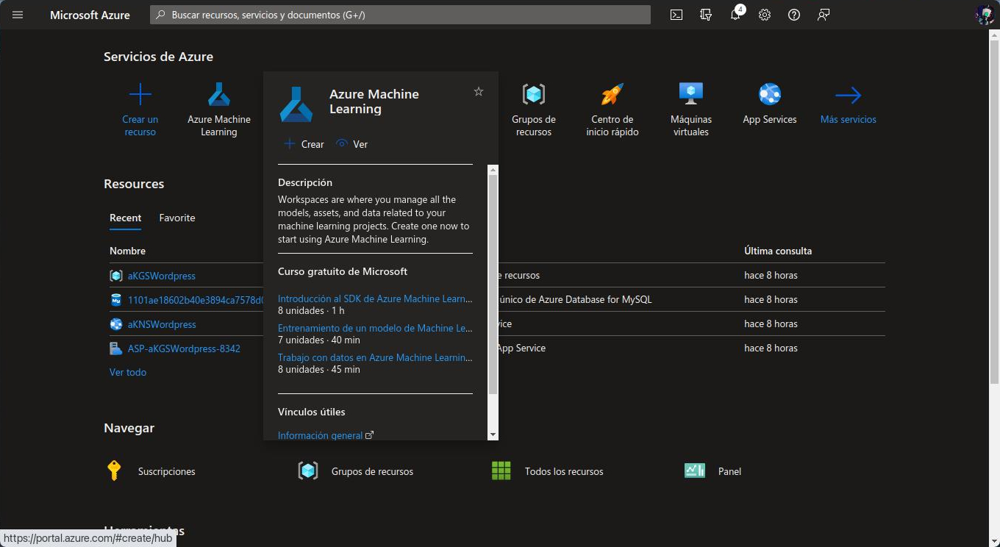

# Crear un Entorno de ejecución de Azure Machine Learning dentro de Azure



Para realizar este trabajo es necesario contar con una suscripción de Azure.

# Área de trabajo
Antes de comenzar a trabajar con Machine Learning Studio, es necesario crear un área de trabajo desde el [portal de Azure](https://portal.azure.com) llamado **Azure Machine Learning**. Para poder crear este recurso es necesario llenar dos formularios:


## Aspectos básicos
Información básica que se necesita para crear recursos en Azure (suscripción, grupo de recursos y nombre).

## Revisión y creación
Valida la información que se ha mencionado anteriormente. Si todo esta bien se puede crear el recurso.


# Estudio de Microsoft Machine Learning
Si el recurso se creo correctamente, podemos acceder a [Microsoft Machine Learning Studio](https://ml.azure.com/home) y ver el recurso que creamos como una opción entre las áreas de trabajo disponibles.


Dentro del área de trabajo, en el aparatado de ```Proceso```, creamos una nueva ```Instancia de proceso```.


Cuando el proceso se termine de crear y se ejeucte, en el apartado de ```Notebooks``` podemos ver el notebook que creamos para crear un archivo nuevo.


Despues de que creamos nuestro archivo, ya podemos usar el notebook para realizar el trabajo que deseamos.

